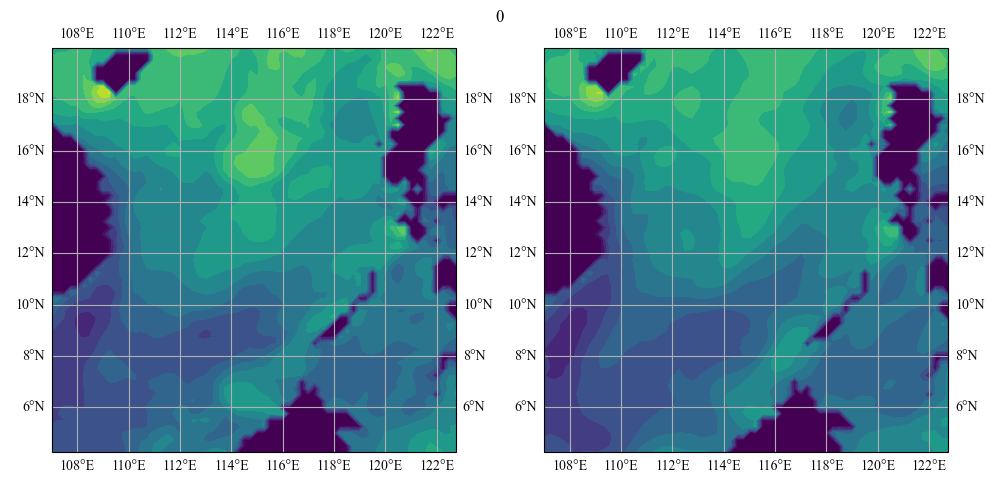
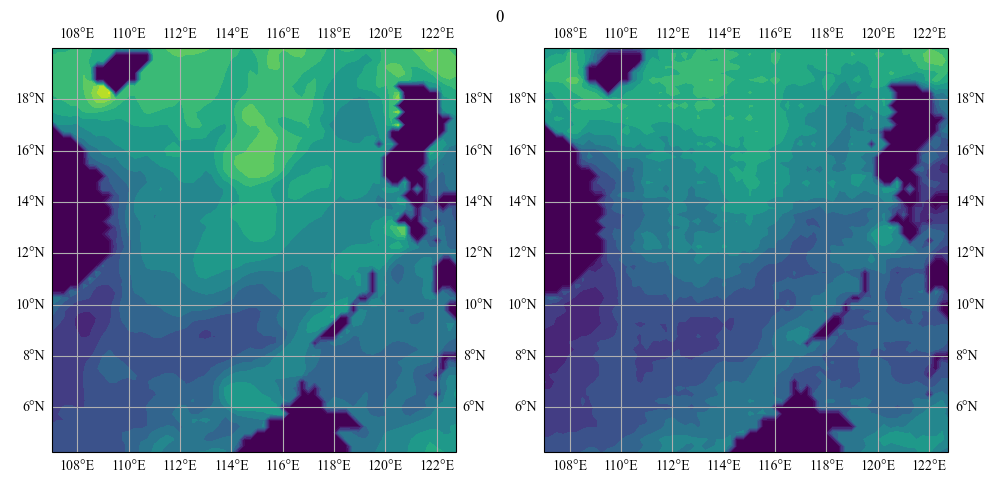
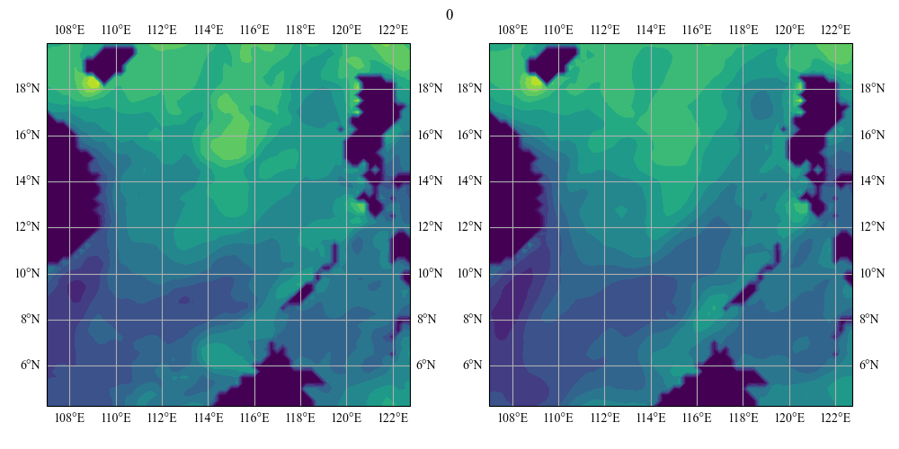
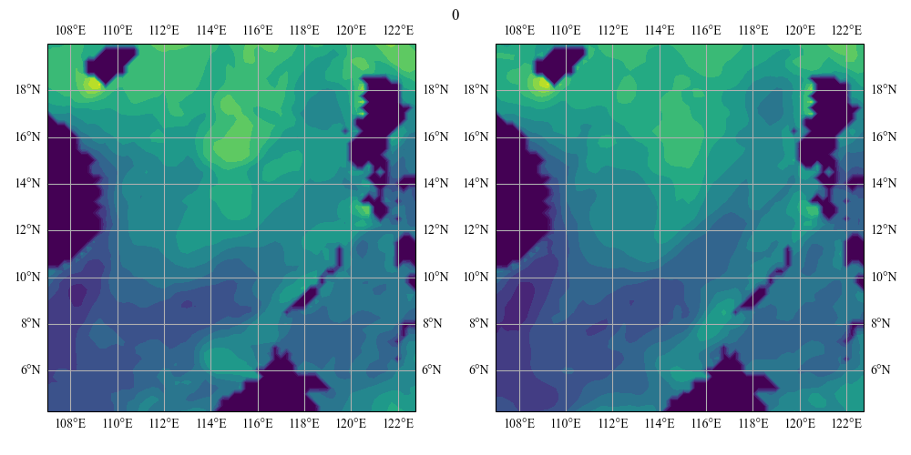
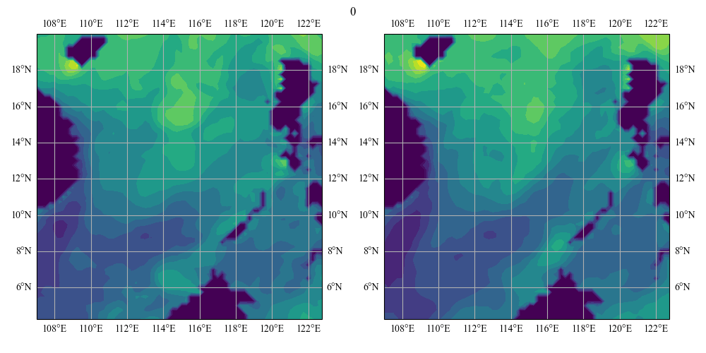
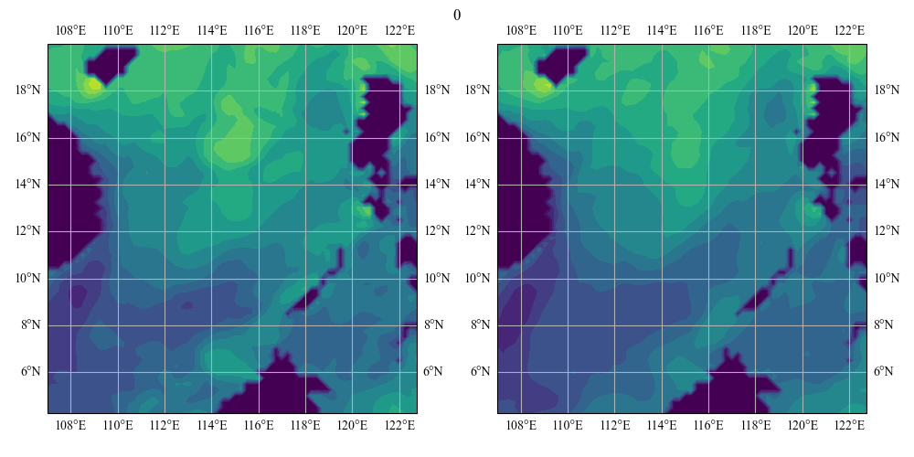
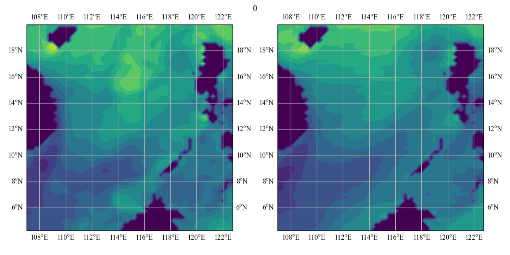
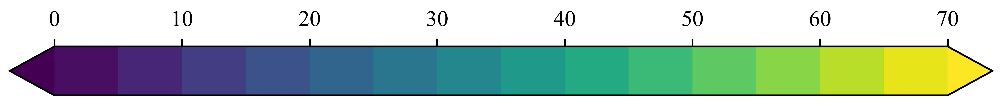

## Benchmark of Spatio-temporal Prediction Model in EDH Forecast

Distinct training modes correspond to separate branches. Displayed below are gifs that illustrate the predictions for training mode2. The left gif represents the truth, while the right gif depicts the forcast.

- **ConvLSTM** 

- **PredRNN** 

- **CrevNet** 

- **SA-ConvLSTM** 

- **PredRNN-v2** 

- **SmaAt-UNet** 

- **SimVP** 

- **SimVP2** 

- **TAU** 

- **MMVP** 

- 